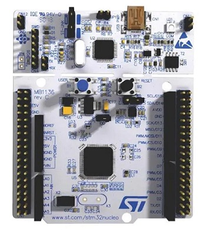
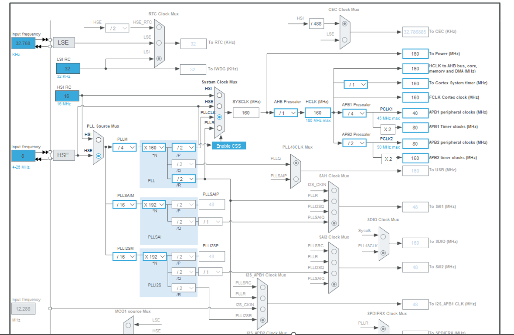
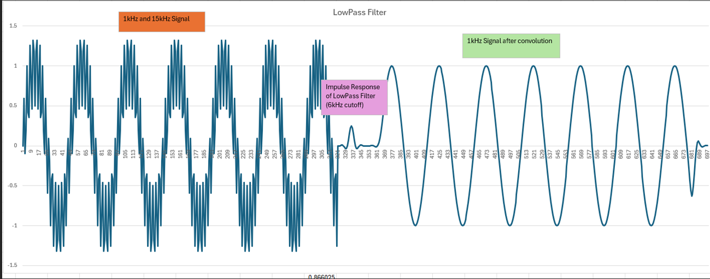
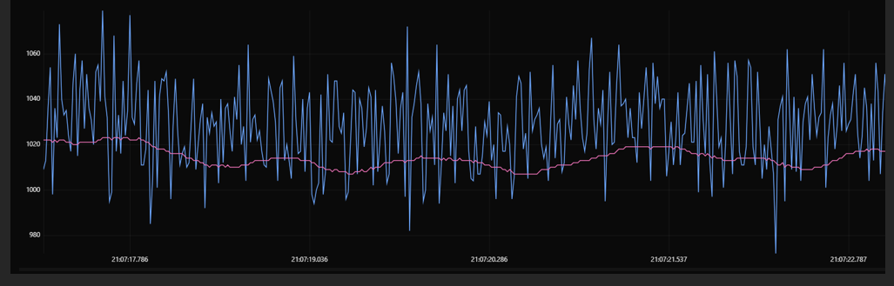
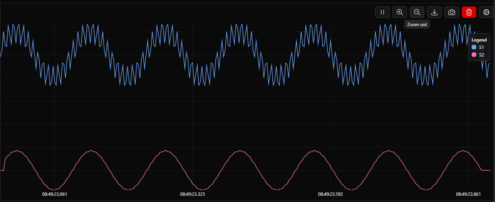

# ArmStmDsp
Testing DSP algorithms on Arm Cortex-M4 (STM32 NUCLEO-F446RE), FPU, CMSIS DSP

STM32 Nucleo-64 development board with STM32F446RE MCU has an Arm Cortex-M4 core with DSP (ADC and DAC) and FPU, and up to 180 MHz CPU.

  

For development we used STM32CubeIDE, it is decent for basic debugging and tinkering with the registers. 

STM also provides a graphical tool called STM32CubeMX, which allows for microcontroller configuration. this tool makes it easy to calculate the necessary register values to increase the system clock speed (SYSCLK) by default it is 16 MHz, but the STM32F446RE can go up to 180 MHz , in this project we went with 160 MHz.
Screenshot below is from CubeMX showing the register values used to get SYSCLK to 160MHz
  

More details about the board will be added to this repo later, below are some of the results from our testing. 

Convolution with Low pass filter with 6Khz cutoff frequency

  

With the FPU and CMSIS, DSP algorithms can be executed very quickly.

arm_conv_f32 CMSIS API is used for convolution with FIR filters designed in Matlab's FDATool

CMSIS library also provides APIs for Fourier Transform like arm_rfft_fast_f32. 
By using the FPU and CMSIS, DSP algorithms can run at least x2 faster and sometimes up to x10 faster compared to running the code using the CPU regular instructions.

Below FIR Filter applied to ADC signal and Moving average filter using CMSIS

  
  